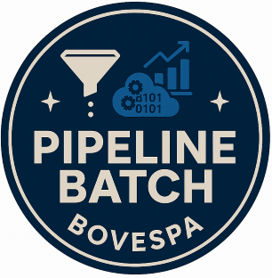
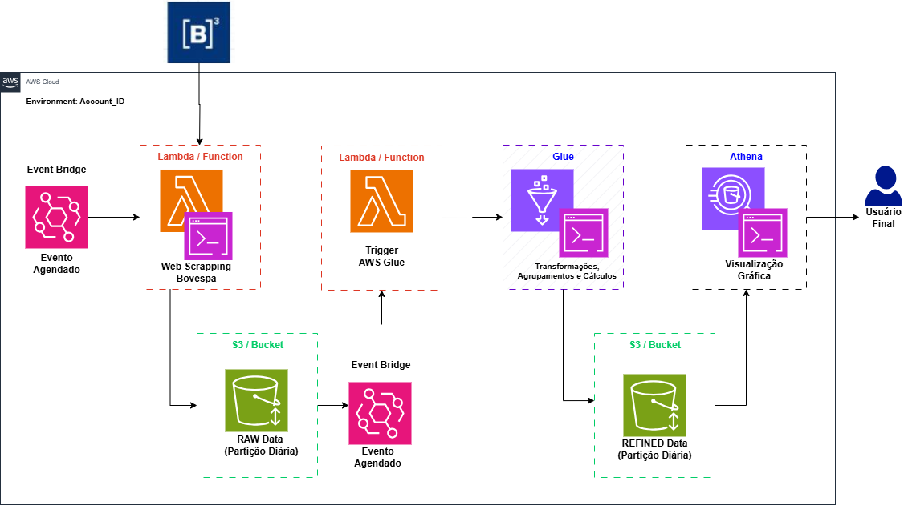

<h1>
   
  Tech Challenge 2 (Fase 2): Pipeline Batch Bovespa: Ingestão e Arquitetura de dados
</h1>

**Tech Challenge** é um projeto que reúne a aplicação dos conhecimentos adquiridos em todas as disciplinas de uma fase da Especialização em Machine Learning Engineering da FIAP PosTech.

Para o Tech Challenge 2, o desafio proposto foi o seguinte:

> 📢 **Problema:** construa um pipeline de dados completo para **Extrair, Processar e Analisar dados do pregão da B3 (IBovespa)**, utilizando AWS S3, Glue, Lambda e Athena. Para acessar os dados, obrigatoriamente acessar o link: [Carteira Teórica o IBovespa](https://sistemaswebb3-listados.b3.com.br/indexPage/day/IBOV?language=pt-br)

Para este desafio as entregas devem ser realizadas utilizando tecnologias da **Amazon Cloud** e atender aos seguintes **Requisitos/objetivos**:

• **Requisito 1:** realizar o scrap de dados do site da B3 (IBovespa), extraindo dados do pregão (dados brutos).

• **Requisito 2:** os dados brutos devem ser ingeridos no S3 em formato parquet com partição diária.

• **Requisito 3:** o Bucket S3 deve acionar uma Lambda, que por sua vez irá chamar um job de ETL no Glue.

• **Requisito 4:** a Lambda pode ser em qualquer linguagem. Ela apenas deverá iniciar o job Glue.

• **Requisito 5:** o job Glue deve ser feito no modo visual. Este job deve conter as seguintes transformações obrigatórias:


 
<ol style="list-style-type: lower-alpha">
  <li>Realizar agrupamento numérico, sumarização, contagem ou soma;</li>
  <li>Renomear duas colunas existentes, além das colunas de agrupamento;</li>
  <li>Realizar um cálculo com campos de data; por exemplo, poder ser duração, comparação ou diferença entre datas.</li>
</ol>

• **Requisito 6:** os dados refinados no job Glue devem ser salvos no formato parquet em uma pasta chamada REFINED, particionados por data e pelo nome ou abreviação da ação do pregão.

• **Requisito 7:** o job Glue deve automaticamente catalogar o dado no Glue Catalog e criar uma tabela no banco de dados default do Glue Catalog.

• **Requisito 8:** os dados devem estar disponíveis e legíveis no Athena.

• **Requisito 9:** (OPCIONAL) construir um notebook no Athena para realizar uma visualização gráfica dos dados ingeridos.

• **Requisito 10:** (OPCIONAL) construir uma Pipeline Stream Bitcoin, conforme arquitetura de referência fornecida.

## 📌 Objetivos

- Elaborar a **Arquitetura do projeto**, demonstrando todas as fases da pipeline;
- Implementar as tecnologias para o atendimento dos requisitos da Pipeline de Ingestão de Dados da B3;
- Documentar o projeto de forma a permitir a sua reprodução;
- Disponibilizar a documentação em um repositório no **GitHub**.

## Possíveis dores

- Falta de automação na obtenção dos dados bem como seu tratamento;
- Falta de padronização para acesso aos dados bem como tipos de retornos e formatos mais adequados para consumo na produção de consultas e analytics;
- Suporte e documentação insuficientes;
- Redundância de dados em histórico confiável, com fonte de dados própria;
- Baixa capacidade de análise em questões relevantes para o usuário final.

## Proposta de solução

Em face ao desafio proposto, algumas funcionalidades propostas (stages) para a Pipeline Batch Bovespa:

- Ingestão de dados: coleta automática de dados (webscraping) extraídos do site B3 (IBovespa), por meio de uma Lambda que é iniciada por um evento agendado;
- Armazenamento de dados: salvamento dos dados bruto (RAW) em parquet, com partição diária, dentro Bucket S3;
- Processamento: limpeza, transformação e padronização, usando script em Glue acionado assim que um novo arquivo é carregado no Bucket S3;
- Carga final: gravação de dado procesado (REFINED), com partição diária, em Bucket S3;
- Catalogação: atualização do catálogo do glue informando a partição diária que foi criada;
- Agregações e Cálculos: agregações e cálculos realizados nos dados refinados extraídos via athena e analisados no Google Colab;
- Consumo: leitura dos dados refinados e agregados para a produção de relatórios e dashboards, usando Athena e Google Colab.


**Importante**

Toda a implementação foi feita via Terraform, com o princípio de **Infrastructure as a Code**, e está documentada neste repositório. Consulte a [documentação principal](docs/README.md) para mais detalhes.


### 📂 Estrutura do projeto

```
terraform-infra-pipeline-aws/
├── .github/
│   └── workflows/
│       ├── develop.yaml
│       ├── prod.yaml
│       └── terraform.yaml
├── app/
│   ├── src/
│   │   └── main.py             # Script principal do Job Glue
│   └── utils/
│       └── ...                 # Módulos Python auxiliares para o Glue
├── docs/
│   ├── imagens/
│   │   └── ...                 # Diagramas e imagens do projeto
│   └── license/
│       └── license.txt
├── infra/
│   ├── envs/
│   │   ├── dev/
│   │   │   └── terraform.tfvars  # Variáveis específicas do ambiente de DEV
│   │   └── prod/
│   │       └── terraform.tfvars  # Variáveis específicas do ambiente de PROD
│   ├── modules/                # Módulos Terraform reutilizáveis
│   │   └── ...
│   ├── main.tf                 # Arquivo principal com a definição dos recursos
│   ├── variables.tf            # Declaração das variáveis de entrada
│   ├── versions.tf             # Versões do Terraform e dos providers
│   └── backend.tf              # Configuração do state remoto
├── lambda/
│   ├── lambda_function.py      # Código da Lambda que inicia o Job Glue
│   └── lambda_functions_scrapper.py # Código da Lambda que faz o scraping
└── README.md                   # Documentação do projeto
```

### 🔩 Arquitetura da solução

A arquitetura da solução foi desenhada com base nos stages necessários ao atendimento de requisitos e consta na pasta de documentação deste repositório



Em face ao desafio proposto, segue detalhes da solução:

1.  **Extração de Dados (Scraping)**
    *   Event Bridge com um evento agendado 1 vez ao dia.
    *   Lambda é invocada pelo evento e realiza o scrap da página da B3.
2.  **Ingestão no Amazon S3**
    *   Salva os dados brutos em formato parquet dentro de um bucket S3 com partição diária de acordo com a data do pregão.
3.  **Evento de notificação do S3**
    *   Uma notificação é enviada pelo S3 para uma lambda a cada novo arquivo de dados brutos que é carregado no bucket.
4.  **Transformação com AWS Glue**
    *   A lambda invocada inicia o processamento do Glue Job.
    *   O glue job realiza as seguintes operações:
        *   Leitura do arquivo parquet com dados brutos.
        *   Realiza conversão dos dados numéricos da nomenclatura BR para UI.
        *   Renomeia as colunas e carrega os dados na tabela de resultados refinados.
        *   Disponibiliza os dados via Athena.
5.  **Realização de análises de dados refinados**
    *   Extração dos dados refinados e cópia para o Google Colab para realização das seguintes operações:
        *   Agregação: total de negociações por ação.
        *   Cálculo temporal: análise de partição em cada ação.


## Vídeo de Apresentação no Youtube
Para melhor compreensão da entrega, foi produzido um vídeo de apresentação que foi publicado no Youtube:

[Link para a Vídeo](inserir link)


## ✒️ Autores

| Nome                            |   RM    | Link do GitHub                                      |
|---------------------------------|---------|-----------------------------------------------------|
| Ana Paula de Almeida            | 363602  | [GitHub](https://github.com/Ana9873P)               |
| Augusto do Nascimento Omena     | 363185  | [GitHub](https://github.com/AugustoOmena)           |
| Bruno Gabriel de Oliveira       | 361248  | [GitHub](https://github.com/brunogabrieldeoliveira) |
| José Walmir Gonçalves Duque     | 363196  | [GitHub](https://github.com/WALMIRDUQUE)            |
| Pedro Henrique da Costa Ulisses | 360864  | [GitHub](https://github.com/ordepzero)              |

## 📄 Licença


Este projeto está licenciado sob a Licença MIT.  
Consulte o arquivo [license](docs/license/license.txt)  para mais detalhes.